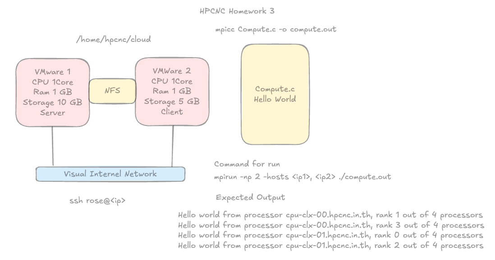
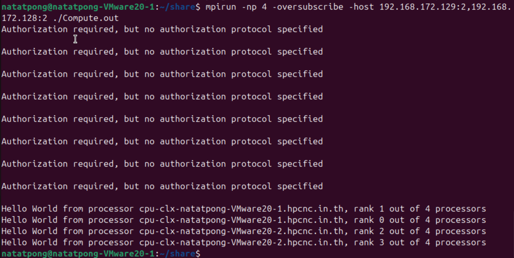

title : set up cluster with open mpi 

resource

https://mpitutorial.com/tutorials/

https://www.geeksforgeeks.org/linux-unix/creating-an-mpi-cluster/

https://github.com/adeen-atif/MPI-Cluster/tree/main

---



setting list 

- Create 2 VMs
- SSH (password less)
- NFS (network file system)
- Open MPI

### Virtual Machine

1. Using VMware Fusion (Macbook) 
2. Download Ubuntu 24.04.3 LTS (ตอนนั้นคิดไรไม่รู้เลยโหลด version นี้มา)
3. install net-tools (สำหรับดู ip)

### SSH

1. ping ดูว่ามันเจอกันไหม เพราะถ้าไม่อยู่ใน network เดียวกันมันจะหากันไม่เจอ (อันนี้หาเจอไม่ต้องทำอะไร)
2. install ssh package 
    
    https://hostman.com/tutorials/how-to-install-and-configure-ssh-on-ubuntu-22-04/
    
3. set Key (Public Private) อันนี้ทำทั้ง 2 เครื่องเลย host → client ได้ & client → host ได้ (เพราะกำลังงงว่าตอนรัน mpi ทำไมมันไม่ขึ้นอะไรเลย)

### NFS

https://www.digitalocean.com/community/tutorials/how-to-set-up-an-nfs-mount-on-ubuntu-20-04

https://www.youtube.com/watch?v=zmDIfJtCKCk

1. install servers & client package เเยกกัน

```python
Install NFS (HOST-servers)
sudo apt install nfs-kernel-server

Install NFS (Client)
sudo apt install nfs-common
```

1. Set up Servers

```python
mkdir share #สร้าง folder share ~/share 
#pwd /home/natatpong/share 

#change the export file to mount the system
vim /etc/exports 
write 
```
/home/natatpong/share *(rw,sync,no_root_squash,no_subtree_check)
```
# * คือจาก ip อะไรก็ได้ ถ้าจะ specific ก็ใส่ ip ไป
# rw 
# sync 
# no_root_squash
# no_subtree_check

systemctl restart nfs-kernel-server
systemctl status nfs-kernel-server #make sure the nfs exports file work 
```

1. Mount on client

```python
showmount --exports 192.168.172.128 #show the route from server that can mount
sudo mount 192.168.172.128:/home/natatpong/share ~/share #from server 128 and dir share to local share
df -h #for show the mount and view the folder is the file exist?

#test nfs work by create file on client -> check on servers 
```

### Open MPI

https://docs.open-mpi.org/en/v5.0.x/installing-open-mpi/quickstart.html

https://curc.readthedocs.io/en/latest/programming/MPI-C.html

```python
sudo apt install openmpi-bin
sudo apt install libopenmpi-dev

https://packages.debian.org/sid/openmpi-bin
https://stackoverflow.com/questions/26920083/fatal-error-mpi-h-no-such-file-or-directory-include-mpi-h
```

```c
//Complied 
mpicc -o Compute.output Compute.c

mpirun -np 4 -host <ip1>:2, <ip2>:2 Compute.output

// : 2 is num processing per node
```

## Error & Problem section

1. ตอนเเรกก็ setting ตามข้างบนเเต่ username คนละอัน เเล้วพอ set NFS มันเลยออกมาเป็นคนละ path

```c
Servers Path : /home/natatpong/share
Client Path  : /home/run/share 
```

ติดอยู่ตรงนี้นานมาก ก็เลยไปคุยกับ gpt มันก็ลองให้ check ssh ได้ไหม (ก็เลย set up ssh ทั้ง client - server), firewall, openmpi version เเล้วก็ไม่เจอว่า มีคน tutorial เเล้ว set up user เป็น user เดียวกันก็เลยไปลองทำตาม + คุยกับ gpt ว่ามันเป็นไปได้ไหม เเล้วก็ลอง set up vm อีกอันที่ มี user เดียวกันขึ้นมาเเล้วก็ mount path เดียวกัน เป็น `/home/natatpong/share` จากนั้นก็รันได้ 

เเต่ processor name เป็น “natatpong-VMware20-1” เหมือนกันเลยเปลี่ยนเป็น 1 & 2

```c
// check current hostname
hostnamectl

// set new hostname
sudo hostnamectl set-hostname natatpong-VMware20-2
```



ส่วน `Authorization required, but no authorization protocal specified` อันนี้ลองหาใน stackoverflow ลอง `sudo systemctl restart display-manager` อันนี้ไม่ได้เเล้วก็ถาม gpt มันบอกว่าถ้ารันใน private cluster หรือ local มันต้องซีเรียส ก็ขอส่งเเค่นี้ก่อนคับ